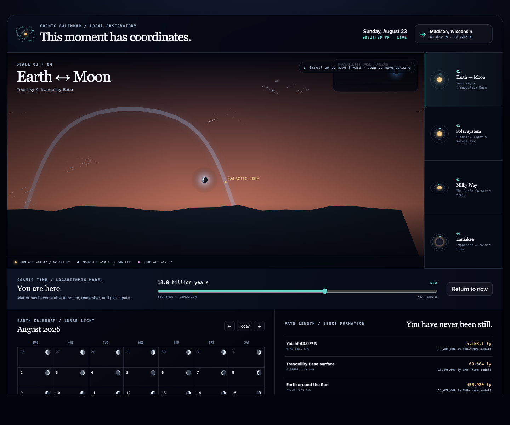

# Cosmic Calendar

[](https://github.com/chensational/CosmicCalendar/actions/workflows/ci.yml)
[](https://chensational.github.io/CosmicCalendar/)

**This moment has coordinates.** Cosmic Calendar is a location-aware observatory and calendar that moves smoothly from your horizon to the Solar System, the Milky Way, and the Laniākea flow field. It is delivered as both a reusable React component and native WidgetKit surfaces for every Apple platform that supports widgets.



**[Open the live observatory →](https://chensational.github.io/CosmicCalendar/)**

## What is here

- **Local horizon:** the topocentric Sun with a near-real-time SDO/HMI photosphere, libration-oriented LRO lunar surface, Galactic core, sampled Milky Way plane, and all 9,096 Bright Star Catalogue entries projected for a device or manually entered location, including proper motion, precession, refraction, extinction, B−V color, and altitude-sensitive scintillation.
- **Tranquility Base:** Earth positioned and phased above the Apollo 11 landing-site horizon using the topocentric lunar body frame.
- **Solar System:** the SDO/HMI photosphere, all planets, and 20 major satellites as cached physically lit spheres, IAU/tidally locked surface orientation, finite-Sun umbra/penumbra state, physically projected Saturn rings, and Mercury perihelion precession.
- **Galactic scale:** a measured-parameter barred Milky Way with four extrapolated logarithmic-arm guides, solid VLBI maser-constrained arm segments, dust lanes, and a time-lapse Solar orbit/epicycle/vertical replay that visibly loses certainty beyond the published predictability horizon.
- **Cosmic scale:** a Laniākea velocity-flow visualization with a logarithmic timeline from inflation to an explicitly hypothetical heat-death horizon.
- **Calendar:** a six-week civil month with calculated lunar illumination for every day.
- **Distance console:** latitude-sensitive Earth travel, Tranquility Base, Earth/Sun, Sun/Galactic-center, and Local-Group/CMB model values, including transparent CMB-frame hierarchy estimates.
- **Apple:** shared C/Swift calculation core plus iPhone/iPad, macOS, watchOS, and visionOS app/widget targets.

## React quick start

```bash
npm install
npm run dev
```

As a library:

```tsx
import { CosmicCalendar } from '@chensational/cosmic-calendar';
import '@chensational/cosmic-calendar/styles.css';

export function Home() {
  return <CosmicCalendar />;
}
```

Optional initial coordinates never leave the component:

```tsx
<CosmicCalendar
  initialLocation={{
    latitude: 43.0731,
    longitude: -89.4012,
    elevationMeters: 270,
    label: 'Madison, Wisconsin',
  }}
/>
```

### Interaction

- Scroll **up** over the observatory to move inward: universe → Milky Way → Solar System → Earth/Moon.
- Scroll **down** to move outward.
- At the innermost boundary, continuing inward advances cosmic time toward the heat-death model.
- At the outermost boundary, continuing outward rewinds toward inflation.
- Arrow Up/Down provides the same interaction from the focused canvas.
- Reduced-motion preferences stop continuous motion while preserving every calculated view.

## Apple widgets

The checked-in `apple/CosmicCalendar.xcodeproj` contains app and WidgetKit targets for:

| Device family | App | Widgets |
| --- | --- | --- |
| iPhone / iPad | `CosmicCalendarPhone` | Home Screen, Lock Screen, StandBy |
| Mac | `CosmicCalendarMac` | Desktop and Notification Center |
| Apple Watch | `CosmicCalendarWatch` | Smart Stack and complications |
| Apple Vision Pro | `CosmicCalendarVision` | Windowed app and widgets |

Apple TV does not expose WidgetKit widget families, so it cannot host this widget. See [Apple setup and privacy](docs/APPLE.md). The native core uses the vendored C edition of Astronomy Engine and works without JavaScript, a server, or a network connection.

## Verification

```bash
npm run typecheck       # strict TypeScript
npm test                # calculation and JPL fixture tests
npm run build           # demo + ESM/CJS library bundles
npm run apple:test      # C/Swift build + standalone native verifier
```

Committed JPL fixtures check the Sun, the topocentric lunar disc from Madison, and Earth from Tranquility Base. Web and native calculations agree with JPL Horizons within the documented compact-model/refraction tolerances. Satellite seed states can be refreshed with `npm run ephemeris:update`; `npm run stars:update` reproduces the pinned CDS catalog, `npm run moon:update` rebuilds the embedded NASA LRO albedo map, and `npm run sun:update` refreshes the compact timestamped SDO/HMI continuum frame.

## Scientific scope

Cosmic Calendar distinguishes **measured state**, **bounded ephemeris**, and **illustrative model**. It never presents an unknowable multi-billion-year path as an exact odometer.

- Modern Sun, Moon, and planet positions use [Astronomy Engine](https://github.com/cosinekitty/astronomy), calibrated against JPL numerical ephemerides. The UI declares a conservative 3000 BCE–3000 CE planetary display bound.
- A compact [NASA Solar Dynamics Observatory HMI](https://sdo.gsfc.nasa.gov/data/) continuum quicklook supplies the observed Earth-facing photosphere near its timestamp. It is refreshed during the three-hour Pages schedule and used only within 36 hours of observation; other dates use a clearly labeled limb-darkened, differentially rotating procedural fallback rather than a mismatched image.
- Terrestrial stars come from the [CDS Bright Star Catalogue V/50](https://cdsarc.cds.unistra.fr/viz-bin/cat/V/50); a compact pinned binary keeps catalog delivery independent of third-party runtime services.
- Planetary-satellite reference states come from the [NASA/JPL Horizons API](https://ssd-api.jpl.nasa.gov/doc/horizons.html). The Moon and four Galilean satellites use integrated analytic models; the other 15 use JPL-seeded osculating Kepler propagation, clearly identified in the public data model.
- Galactic and cosmic history cannot be reconstructed as a unique trajectory. Those views are uncertainty-aware explanatory models, not astrometric ephemerides.
- “Distance traveled since formation” is not directly observable because rotation, orbits, and reference frames changed. Values therefore use cited formation ages and current-rate-equivalent integrations. Every row exposes its method.

See [Scientific method and source ledger](docs/SCIENTIFIC_METHOD.md) for constants, uncertainties, reference frames, and non-claims.

## Performance and privacy

- Canvas rendering starts from a 2× device-pixel-ratio cap, then adapts resolution, frame rate, and faint-star effects when measured main-thread or deferred raster work is too expensive.
- `ResizeObserver` and `IntersectionObserver` pause work offscreen.
- No texture downloads, third-party runtime calls, telemetry, advertising, or application server is required. The 8 KiB lunar albedo map and ~2.3 KiB compact solar frame are embedded; the demo loads one same-origin static star-catalog binary.
- Browser coordinates remain in local storage. Apple coordinates remain in the signed app group's `UserDefaults`.
- Production React library (including exported CosmicWatermark): approximately **82.5 KB gzip main JavaScript + 3.5 KB gzip CSS**. The **140 KB gzip** star-catalog chunk loads only when the calendar mounts.

More detail: [Performance architecture](docs/PERFORMANCE.md).

## Repository map

```text
src/core/                 astronomy, satellite, time, calendar, distance models
src/components/           React UI and high-performance canvas renderer
src/CosmicWatermark/      copied Apollo CosmicWatermark components
src/data/                 pinned JPL states, quantized stars, LRO albedo, and SDO photosphere
apple/                    native C/Swift core, apps, widgets, Xcode project
docs/                     methods, Apple setup, validation, requirements ledger
scripts/                  reproducible ephemeris data update
```

## License

Project code is MIT licensed. The vendored Astronomy Engine C source is also MIT licensed by Don Cross; see `NOTICE` and `apple/Sources/CAstronomyEngine/LICENSE`.
